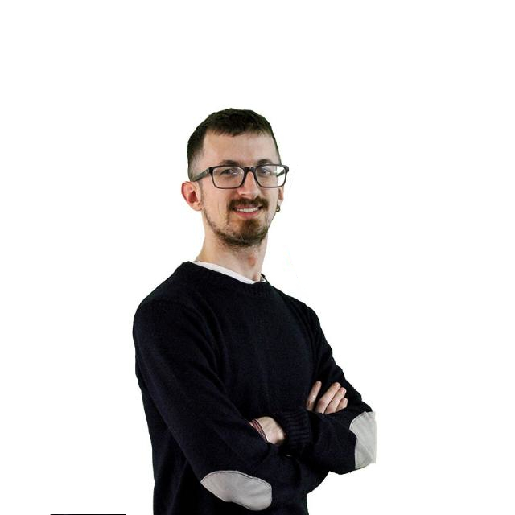

# 👨‍💻 About Me

  

Hi, I'm **Fabrizio Mastrobattista** — a passionate **Web Developer** specialized in crafting modern websites and web applications.

🎓 I graduated in **2016** with a degree in *Information Engineering* (Computer Science branch) from **La Sapienza University** in Rome.

💼 I started my career as a **Beta Tester** for an American multinational company, but quickly shifted to my true passion: **web development**. I enjoy building websites and web applications using a wide range of technologies.  
I love problem-solving and constantly learning new things along the way.

---

# 🛠️ Technologies I Use

| **Frontend** | **Backend** | **Database** | **Tools & Others** |
| :---: | :---: | :---: | :---: |
|  |  |  |  |
|  |  | |  |
|  |  |  |
|  |  |  |  |
|  |  |  |  |
|  |  |  |  |
|  |  |  |  |

---

# 📈 GitHub Stats

---

# 🤝 Connect With Me

- 🔗 [GitHub](https://github.com/fabriziom90/Fabrizio-Mastrobattista.git)  
- 💼 [LinkedIn](https://www.linkedin.com/in/fabrizio-mastrobattista-024aa0136/)

---

# 🚀 What I Love Doing
- Designing and developing user-friendly, responsive websites  
- Building scalable REST APIs and backend services  
- Problem-solving with clean, efficient, and maintainable code  
- Exploring new technol
